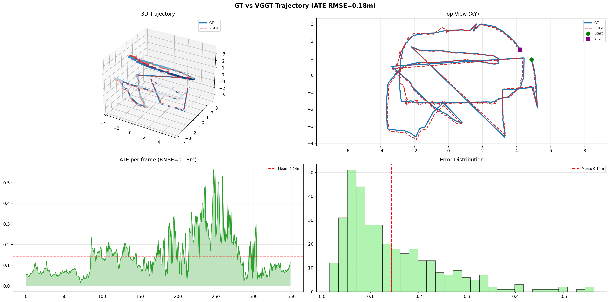
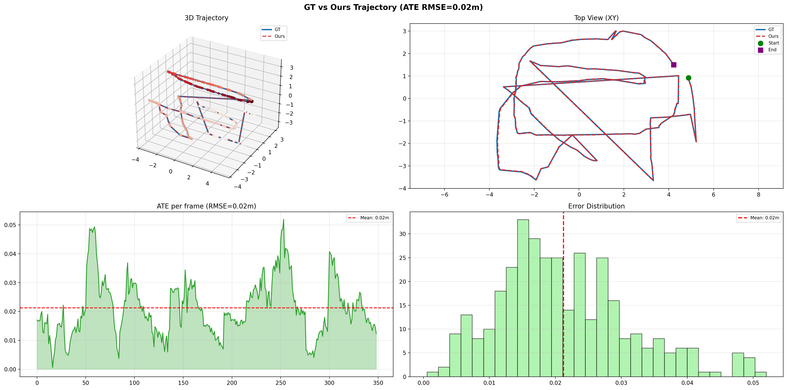
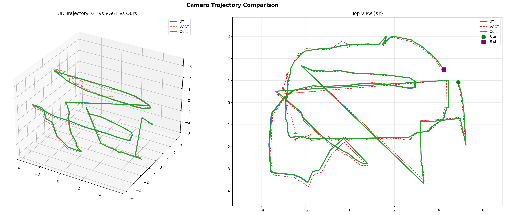
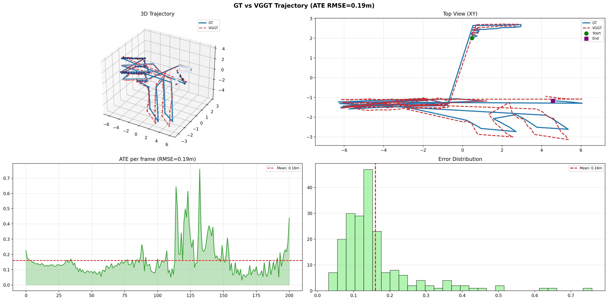
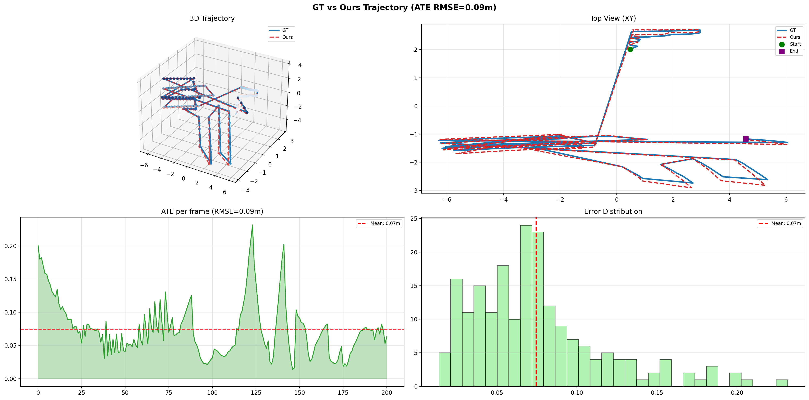
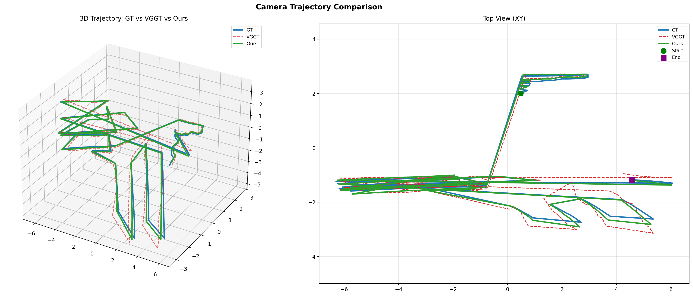
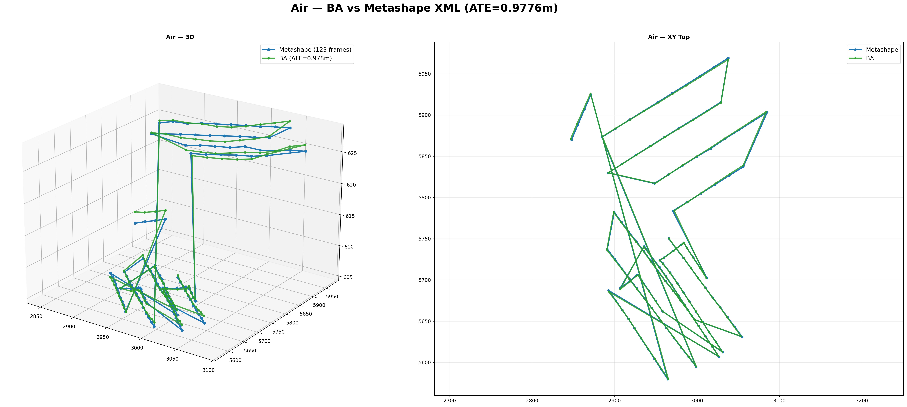
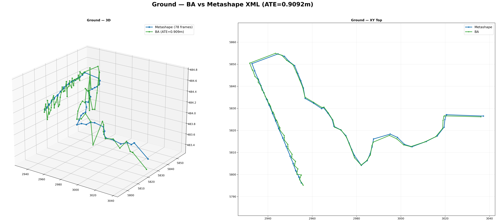

# VGGT-BA: Bundle Adjustment for VGGT Camera Poses

对 VGGT 生成的相机位姿、深度、内参进行全局 Bundle Adjustment 优化。

## 环境配置

```bash
# 安装依赖
conda create -n VGGT-BA python=3.10 -y
conda activate VGGT-BA
conda install -c pytorch pytorch torchvision -y
pip install numpy pycolmap roma kornia tqdm pillow matplotlib scipy

# 依赖 vggt-omega 的图像加载模块
git clone https://github.com/Linketic/vggt-omega.git /path/to/vggt-omega
# 修改 run_ba.py 中的 vggt-omega 路径:
# sys.path.insert(0, '/path/to/vggt-omega')
```

## 使用方法

### 1. 准备输入

```
input/<scene_name>/
├── images/              # 原始图像
├── predictions.npz      # VGGT 预测 (depth, extrinsics, intrinsics)
└── sparse/
    ├── 0/               # COLMAP 模型 (用于读取原始分辨率、相机模型)
    │   ├── cameras.bin
    │   ├── images.bin
    │   └── points3D.bin
    └── 1/               # GT 位姿 (可选，用于评估)
        ├── cameras.bin
        ├── images.bin
        └── points3D.bin
```

### 2. 运行 BA 优化

```bash
conda activate VGGT-BA

# 主流程: SP+LG 匹配 → RANSAC 验证 → 角度滤波 → UF 建 track → 3D 初始化 → Ceres BA
export CUDA_VISIBLE_DEVICES=2 && python -u run_ba.py --scene input/lib

# 参数说明:
#   --scene      场景路径 (默认: input/lib)
#   --sp_res     SP 分辨率 (默认: 1600)
#   --tau_aa     同类型帧角度滤波阈值 (°) (默认: 1.0)
#   --tau_ga     空地帧角度滤波阈值 (°) (默认: 10.0)
#   --topk       每对图像最大观测数 (默认: 500)
#   --max_iter   BA 最大迭代次数 (默认: 100)
```

### 3. 评估与可视化

```bash
# 定量评估 (ATE: 全局 + 空中/地面分项)
python evaluate.py [scene_name]

# 轨迹可视化 (3D + XY + 逐帧误差)
python plot_trajectory.py --scene [scene_name]

# 与 Metashape XML 参考对比 (仅 lib 场景)
python compare_xml.py input/lib
```

### 4. 输出

```
output/<scene_name>/sparse/0/
├── cameras.bin          # 优化后的相机内参 (EXIF 分组)
├── images.bin           # 优化后的相机外参
├── points3D.bin         # 优化后的 3D 点 (带颜色)
├── traj_gt_ours.png     # GT vs BA 轨迹图
├── traj_gt_vggt.png     # GT vs VGGT 轨迹图
└── traj_all.png         # 三合一对比图 (GT / VGGT / BA)
```

## 管线架构

```
VGGT 预测 (poses, depth, intrinsics)
    │
    ▼
┌─────────────────────────────────────────────────┐
│ 1. EXIF 相机分组    →  每类相机的独立内参         │
│ 2. SP 特征提取      →  SuperPoint (max 8192)     │
│ 3. 匹配对生成        →  空地规则 / 穷举            │
│ 4. LG 匹配          →  LightGlue                  │
│ 5. RANSAC 验证      →  pycolmap.verify_matches    │
│ 6. 角度滤波          →  双向角误差 + 分类阈值       │
│ 7. Camera-Disjoint UF → 保证 track 内无重复相机    │
│ 8. Top-K 滤波        →  每对图像保留 K 个最优观测   │
│ 9. 3D 点初始化       →  深度加权平均                │
│ 10. Ceres BA        →  Cauchy 鲁棒核 (scale=0.5)  │
│ 11. 点云着色         →  从源图像采样像素颜色         │
│ 12. 评估            →  Umeyama 对齐 → ATE          │
└─────────────────────────────────────────────────┘
    │
    ▼
COLMAP 兼容输出 (cameras.bin, images.bin, points3D.bin)
```

## 关键模块说明

### EXIF 相机分组

从图像 EXIF 读取相机厂商 (Make) + 型号 (Model)，自动分组。每组独立计算内参 (fx, fy, cx, cy)，使用组内中位数。

这解决了不同相机内参不一致导致的 BA 退化问题。例如 lib 数据中:
- **Sony ILCE-5100** (空中): fx≈992, 16mm 镜头
- **Canon EOS M6** (地面): fx≈534, 15mm 镜头

如果使用单一内参，BA 会在空中和地面之间产生冲突，导致空中位姿被拉偏 ~1m。分组后两类相机独立优化，空中 ATE 从 0.19m→0.12m，地面从 0.021m→0.03m。

### Camera-Disjoint Union-Find

在构建 track 时，若两观测属于同一相机则拒绝合并（`union_if_disjoint`）。这避免了同一相机通过不同帧间接连接导致 track 膨胀的问题。之前约 25.7% 的 track 存在重复相机，修复后 track 质量显著提升。

### 角度滤波 (Angular Filter)

对每对匹配点计算双向角误差 (`max(forward, backward)`):
- **Air-Air & Ground-Ground**: τ=1° (严格)
- **Air-Ground**: τ=10° (宽松，允许跨视角差异)
- **Orientation=6 的图像**: 固定 τ=10°

### Top-K 滤波

每对图像最多保留 K=500 个观测对，按 (track 长度, 置信度均值) 降序排序后截断。既控制了内存，又优先保留高质量观测。

### 3D 点初始化

对每个 track 中的所有观测做三角化，取置信度加权平均。初始化后剔除深度为负的点。

### Ceres BA

使用 COLMAP 的 Ceres Solver (LM 二阶优化):
- 损失函数: Cauchy (scale=0.5)
- 不优化焦距和主点 (固定 EXIF 分组值)
- 最多 100 次迭代

### 点云着色

BA 完成后从源图像采样关键点对应的像素 RGB，写入 `points3D.bin`，可在 COLMAP GUI 中查看彩色点云。

## 匹配对生成策略

`utils/pairs.py` 提供两种配对模式，自动检测场景类型：

### 自动检测 (`mode='auto'`，默认)

| 场景类型 | 判断条件 | 策略 |
|---------|---------|------|
| **纯空中场景** (如 picture) | 无 `Terr_` 前缀图像 | **穷举法**: N×(N-1)/2 全配对 |
| **空地混合场景** (如 lib, test) | 存在 `Terr_` 前缀图像 | **规则法**: 距离最近邻 + 序列窗口 |

### 规则法详情

| 配对类型 | 规则 |
|---------|------|
| Air-Air | 每个 Air 图像匹配最近的 15 个 Air 邻居 |
| Ground-Ground | 滑动窗口 20 帧 |
| Air-Ground | 每个 Air 匹配最近的 10 个 Ground + 每个 Ground 匹配最近的 10 个 Air，去重 |

也可手动指定模式: `generate_pairs(img_names, ext_all, mode='exhaustive')` 或 `mode='rules'`

## 结果

### test 场景 (纯空中，89 帧)

| 方法 | ATE (m) |
|------|---------|
| VGGT 初始 | 0.354 |
| BA 优化后 | 0.167 |


*VGGT 初始位姿 vs GT — ATE=0.354m*


*BA 优化后 vs GT — ATE=0.167m，轨迹与 GT 基本重合*


*三合一对比: GT (蓝) / VGGT (橙) / BA (绿)*

### lib 场景 (空地混合，304 帧: 186 空中 + 118 地面)

| 方法 | 全局 ATE | 空中 ATE | 地面 ATE |
|------|---------|---------|---------|
| VGGT 初始 | 0.045m | - | - |
| BA 优化后 | 0.035m | 0.035m | 0.029m |


*VGGT 初始位姿 vs GT — 姿态整体较好，部分区域有偏差*


*BA 优化后 vs GT — 误差进一步降低*


*三合一对比: GT (蓝) / VGGT (橙) / BA (绿)*

### lib 场景 — Metashape XML 参考对比

以 Metashape 建模结果 (UTM 坐标系) 为参考，验证 BA 的绝对精度:

| 方法 | 空中 ATE | 地面 ATE |
|------|---------|---------|
| COLMAP (手工) | 0.762m | 0.850m |
| 我们的 BA | 0.978m | 0.909m |


*空中轨迹: Metashape (蓝) vs BA (绿) — ATE=0.978m*


*地面轨迹: Metashape (蓝) vs BA (绿) — ATE=0.909m*

> 注: COLMAP 手工结果与我们的 BA 在 UTM 坐标系下差距不大 (~0.1-0.2m)，说明 VGGT 初始位姿已经较好。

## 工具脚本

| 脚本 | 功能 |
|------|------|
| `run_ba.py` | **主流程**: SP+LG 匹配 → RANSAC → Angular → UF → Top-K → 3D init → Ceres BA |
| `evaluate.py` | 定量评估: ATE (全局 + 分项) |
| `plot_trajectory.py` | 轨迹可视化: 3D + XY + 误差分布 |
| `compare_xml.py` | 与 Metashape XML 参考对比 (lib 场景) |
| `export_colmap_model.py` | 导出 VGGT 位姿 + 深度 3D 点到 COLMAP 格式 (无 BA) |
| `eval_split.py` | 空中/地面分项评估 |
| `plot_traj_split.py` | 空中/地面分项轨迹绘制 |

## utils 模块

| 文件 | 功能 |
|------|------|
| `pairs.py` | 匹配对生成: 穷举法 / 空地规则法 (10-nearest AG) |
| `colmap.py` | COLMAP 二进制读写 (cameras, images, points3D) |
| `database.py` | COLMAP SQLite 数据库创建与写入 |
| `metrics.py` | ATE, RPE 等评估指标 |

## 依赖

- **PyTorch** ≥ 2.0 — 神经网络推理 (SuperPoint + LightGlue)
- **pycolmap** — Ceres BA 求解器 + COLMAP RANSAC 验证
- **roma** — 旋转数学 (四元数/旋转矩阵转换)
- **kornia** — 极线几何
- **numpy**, **scipy** — 数值计算
- **pillow** — 图像加载
- **tqdm** — 进度条
- **matplotlib** — 轨迹可视化

### 模型权重

首次运行会自动下载 SP+LG 权重 (`weights/sp_lg_100h.ckpt`)，或手动放置到 `weights/` 目录。

### vggt-omega

需安装 vggt-omega 用于图像预处理。如路径不同，修改 `run_ba.py` 中 `sys.path.insert(0, '/path/to/vggt-omega')`。
